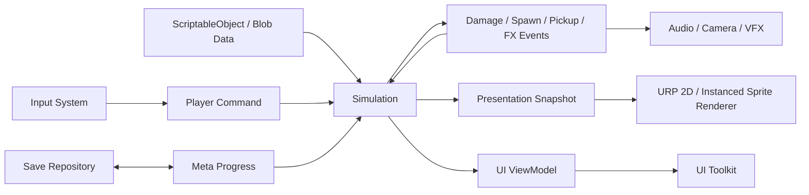

# Survivor 项目 Unity 迁移实施指南

> - 文档状态：迁移设计基线
> - 编写日期：2026-07-24
> - 目标版本：Unity 6.3 LTS，PC/Steam 首发
> - 迁移策略：保留 JavaScript 版本作为行为基准，Unity 双轨对照迁移
> - 核心路线：URP 2D + UI Toolkit + ScriptableObject + 混合 DOTS（Entities/Jobs/Burst）

## 0. 如何使用本文档

本文档不是“把 JavaScript 语法逐句翻译成 C#”的说明，而是一份可以据此建立 Unity 工程、拆分任务、生成代码、验收行为和控制性能风险的实施规范。

迁移期间必须遵守以下原则：

1. **先保存行为，再重写实现。** 当前 JS 版本是数值、攻击节奏、波次和视觉意图的基准。Unity 不要求保留 JS 的类结构，但必须能说明每一项行为如何被保留或有意调整。
2. **模拟与表现分离。** 伤害、碰撞、移动、计时、掉落等属于 Simulation；Sprite、动画、粒子、声音、屏幕震动属于 Presentation。
3. **先建立性能骨架，再批量搬内容。** 空间索引、批量碰撞、实体生命周期、实例化渲染必须在第三、第四阶段完成，不能等 47 个敌人都搬完才优化。
4. **数据只保留一个权威来源。** 迁移期以当前 JSON/JS 配置为基准；Unity 完成切换后以 ScriptableObject 为创作源，并导出规范化 JSON 做差异检查。
5. **每次只迁移一个可验收切片。** AI 或人工每次只处理一个模块、一个敌人或一把武器，并附测试和来源映射。

本文档只规定 Unity 迁移方案，不要求当前 Web 版本立即停止开发，也不要求本仓库现在就创建 Unity 工程。

---

## 1. 当前项目基线

### 1.1 内容规模

根据当前仓库：

| 内容 | 当前规模 | 主要来源 |
|---|---:|---|
| 敌人配置 | 47 个 | [`src/config/enemy-config.json`](src/config/enemy-config.json) |
| 敌人类文件 | 49 个 | [`src/enemies/`](src/enemies/) |
| 武器 | 12 把 | [`src/config/weapon-config.json`](src/config/weapon-config.json)、[`src/systems/weapons.js`](src/systems/weapons.js) |
| 道具 | 21 个 | [`src/config/item-config.json`](src/config/item-config.json)、[`src/systems/items.js`](src/systems/items.js) |
| 品质 | 5 档 | 普通、优秀、精良、史诗、传说 |
| 难度 | 6 个 | ember、neon、overclock、singularity、apocalypse、void_crown |
| 波次场景 | 6 × 20 波 | `src/config/*-wave-scenarios.js` |
| 事件图鉴条目 | 33 个 | [`src/config/event-codex-config.js`](src/config/event-codex-config.js) |
| 大厅 NPC | 11 个 | [`src/systems/lobby.js`](src/systems/lobby.js) |
| 运行时上限/警戒值 | 430 敌人、360 玩家投射物、520 CPU 粒子、800 敌弹警戒、128 危害区警戒、640 武器 FX 警戒 | [`src/constants.js`](src/constants.js)、[`src/systems/runtimeBudgets.js`](src/systems/runtimeBudgets.js) |

### 1.2 当前核心结构

| 当前职责 | JS 入口 | Unity 目标 |
|---|---|---|
| 启动与主循环 | `src/core/main.js` | `GameBootstrap`、`GameFlowController`、系统组 |
| 全局运行状态 | `src/state.js` | `RunState`、ECS Singleton、只读 ViewModel |
| 玩家/生成/敌弹/危害区 | `src/systems/entities.js` | ECS Systems + 玩家纯 C# 模拟 |
| 武器 | `src/systems/weapons.js` | Weapon Definition + Weapon Runtime Systems |
| 道具 | `src/systems/items.js` | Item Definition + 事件触发器 |
| 敌人注册 | `src/systems/enemyRegistry.js` | `GameDataCatalog` + Entity Prefab/Baker |
| 普通敌人与 Boss | `src/enemies/*.js` | ECS 行为组件 / Boss Brain |
| 波次与场景事件 | `src/systems/waveScenarios.js` | `WaveDirector` + Scenario Systems |
| Canvas/Pixi 渲染 | `src/systems/renderer.js`、`src/systems/renderers/pixiBackend.js` | URP 2D + 批量实例渲染 |
| 战斗地图 | `src/systems/map.js` | Seeded Map Generator + Tilemap |
| 大厅 | `src/systems/lobby.js`、`lobbyRenderer.js` | 手工 Tilemap Scene + NPC/交互组件 |
| 商店与背包 | `src/economy/*.js` | 领域服务 + UI ViewModel |
| 存档与图鉴 | `src/systems/playerProgress.js`、`codex.js` | 版本化 Save Repository |
| 自动玩家 AI | `src/ai/` | 后期独立程序集与只读 World Snapshot |
| DOM UI | `index.html`、`styles.css`、`src/ui/` | UI Toolkit：UXML/USS/C# Presenter |

### 1.3 迁移完成的定义

Unity 版本只有同时满足以下条件才算完成：

- 12 把武器、21 个道具、47 个敌人配置、6 套 20 波场景均有对应内容；
- 标准模式、随机模式、商店、背包、合成、图鉴、剧情、大厅、NPC 和 Boss 均可完整游玩；
- 同一配置和随机种子下，关键遥测与 JS 基准在允许误差内一致；
- 目标压力场景 1080p 下持续 60 FPS，预热后每帧托管分配为 0；
- 存档支持版本升级、原子写入、损坏恢复和 Steam Cloud 可选同步；
- 键鼠、手柄、分辨率缩放、中文字体与 Safe Area 均通过验收。

---

## 2. 技术选型

### 2.1 Unity 与包

建议新建 **Unity 6.3 LTS 的 Universal 2D 项目**。Unity 6.3 LTS 的支持周期适合进入正式迁移和生产锁定；不要使用 Alpha/Beta 版本作为项目基线。

建议包：

| 能力 | 选型 | 用途 |
|---|---|---|
| 渲染 | URP 2D Renderer | Sprite、Tilemap、2D Light、Renderer Feature |
| 数据导向模拟 | Entities、Collections、Jobs、Burst | 敌群、弹幕、危害区、空间索引 |
| ECS 渲染 | Entities Graphics 或 BatchRendererGroup | 敌群图集四边形实例化 |
| 输入 | Input System | 键鼠、手柄、触控预留、输入重映射 |
| UI | UI Toolkit | HUD、菜单、商店、背包、图鉴、剧情 |
| 文本 | TextCore/UI Toolkit Font Asset；世界文字可用 TextMeshPro | 中文像素字体与池化伤害数字 |
| 资源 | Addressables | 图集、音频、地图主题、Boss 资源生命周期 |
| 地图 | 2D Tilemap + Tilemap Extras | Tile Palette、Rule Tile、Animated Tile |
| 测试 | Unity Test Framework | EditMode、PlayMode |
| 性能 | Unity Profiler、Memory Profiler | CPU/GPU/内存和分配审查 |

创建工程后立即把实际包版本锁定到 `Packages/manifest.json` 和 `Packages/packages-lock.json`。升级包必须单独建分支并完整重跑金样和压力测试。

官方参考：

- [Unity 6 发布与支持周期](https://web-prd.hexagon.unity.com/releases/unity-6/support)
- [Unity 6.3 URP 2D Lighting](https://docs.unity3d.com/6000.3/Documentation/Manual/urp/2d-index.html)
- [Entities 1.4](https://docs.unity3d.com/Packages/com.unity.entities%401.4/manual/index.html)
- [Entities Graphics 1.4](https://docs.unity3d.com/Packages/com.unity.entities.graphics%401.4/manual/index.html)
- [Collections](https://docs.unity3d.com/Packages/com.unity.collections%402.5/manual/index.html)
- [Addressables](https://docs.unity3d.com/Packages/com.unity.addressables%402.3/manual/index.html)
- [UI Toolkit Runtime UI](https://docs.unity3d.com/6000.3/Documentation/Manual/UIE-HowTo-CreateRuntimeUI.html)
- [2D Tilemap Extras](https://docs.unity3d.com/Packages/com.unity.2d.tilemap.extras%406.0/manual/index.html)

### 2.2 为什么选择混合 DOTS

本项目的性能压力来自“数量多且逻辑相似”的对象，而不是玩家或 Boss 的数量：

- 数百普通敌人需要移动、邻域查询和伤害结算；
- 数百至上千弹幕/危害对象需要生命周期和圆/线/扇形判定；
- 掉落物需要磁吸、合并和拾取；
- 大量装饰粒子只影响表现；
- Boss 数量少，但状态机、技能和演出极其复杂。

因此不应把所有内容都强行做成同一种技术：

| 对象 | 运行方式 | 原因 |
|---|---|---|
| 普通敌人、精英 | ECS + Burst | 数量大、数据结构相似、适合批处理 |
| 玩家 | 纯 C# Simulation + GameObject View | 单个对象、输入和反馈复杂、需要易调试 |
| Boss | 纯 C# `IBossBrain` + GameObject View；弹幕/危害请求进入 ECS | 数量少、状态机复杂，避免 ECS 结构变化淹没业务逻辑 |
| 玩家/敌方投射物 | ECS + Burst | 高频创建、移动、查询和销毁 |
| 危害区/场景技能 | ECS 数据；渲染独立 | 判定必须可靠，不能由粒子效果决定 |
| 掉落物 | ECS + Burst | 数量大、行为统一 |
| 地图与大厅 | Tilemap/GameObject | 静态内容，编辑器体验优先 |
| NPC | GameObject + 纯 C# 状态机 | 数量少、对话和交互复杂 |
| 装饰粒子 | GPU VFX/ParticleSystem 池 | 不参与游戏判定 |
| UI | UI Toolkit | 文本和列表密集，适合 UXML/USS 与数据绑定 |

### 2.3 不选择的方案

- **全 GameObject + MonoBehaviour：** 当前规模经过严格池化也能运行，但数百对象各自 `Update()`、Animator、Collider 和 Transform 同步会降低未来上限。
- **全量 ECS：** 会让 Boss、NPC、剧情、商店和 UI 的开发成本大幅上升，且对当前团队没有足够收益。
- **Physics2D 驱动全部战斗：** 弹幕生存游戏的圆形/线段/扇形判定可用数学和空间网格更稳定、更快地完成；Physics2D 只保留给静态地图碰撞和少量特殊刚体。
- **每个敌人一个 Animator：** 对少量 Boss 可接受，对数百敌人不合适。普通敌人的序列帧由实例数据中的帧索引和 UV 驱动。

---

## 3. 总体架构

### 3.1 分层与数据流



依赖规则：

1. Simulation 不引用 Sprite、Material、AudioClip、VisualElement 或场景 GameObject。
2. Presentation 可以读取只读快照和事件，但不能直接修改战斗数据。
3. UI 只能通过 Command/Service 修改商店、背包和流程状态，不能遍历 ECS World。
4. Content/Data 只描述内容，不保存本局计时器、血量或实体引用。
5. Infrastructure 实现文件系统、Steam、Addressables 等外部能力，领域层只依赖接口。

### 3.2 推荐工程目录

```text
UnityProject/
├─ Assets/
│  ├─ Survivor/
│  │  ├─ Core/
│  │  │  ├─ Runtime/
│  │  │  └─ Survivor.Core.asmdef
│  │  ├─ Data/
│  │  │  ├─ Runtime/
│  │  │  ├─ Authoring/
│  │  │  └─ Survivor.Data.asmdef
│  │  ├─ Simulation/
│  │  │  ├─ Common/
│  │  │  ├─ Player/
│  │  │  ├─ Enemies/
│  │  │  ├─ Weapons/
│  │  │  ├─ Items/
│  │  │  ├─ Waves/
│  │  │  └─ Survivor.Simulation.asmdef
│  │  ├─ Presentation/
│  │  │  ├─ Rendering/
│  │  │  ├─ Animation/
│  │  │  ├─ VFX/
│  │  │  ├─ Audio/
│  │  │  └─ Survivor.Presentation.asmdef
│  │  ├─ UI/
│  │  │  ├─ Runtime/
│  │  │  ├─ UXML/
│  │  │  ├─ USS/
│  │  │  └─ Survivor.UI.asmdef
│  │  ├─ Content/
│  │  │  ├─ Definitions/
│  │  │  ├─ Prefabs/
│  │  │  ├─ Sprites/
│  │  │  ├─ Atlases/
│  │  │  ├─ VFX/
│  │  │  ├─ Audio/
│  │  │  └─ Maps/
│  │  ├─ Infrastructure/
│  │  │  ├─ Save/
│  │  │  ├─ Steam/
│  │  │  ├─ Addressables/
│  │  │  └─ Survivor.Infrastructure.asmdef
│  │  ├─ Editor/
│  │  │  ├─ Importers/
│  │  │  ├─ Validators/
│  │  │  ├─ MapTools/
│  │  │  └─ Survivor.Editor.asmdef
│  │  └─ Tests/
│  │     ├─ EditMode/
│  │     └─ PlayMode/
│  ├─ AddressableAssetsData/
│  └─ Scenes/
│     ├─ Bootstrap.unity
│     ├─ Lobby.unity
│     └─ Battle.unity
├─ Packages/
└─ ProjectSettings/
```

程序集依赖方向：

```text
Core
├─ Data -> Core
├─ Simulation -> Core + Data + Entities/Burst
├─ Presentation -> Core + Data + Simulation + URP
├─ UI -> Core + Data
├─ Infrastructure -> Core + Data
└─ Editor/Tests -> 上述目标程序集
```

严禁 `Simulation -> UI`、`Simulation -> Presentation` 或 `Data -> Scene` 的反向依赖。

### 3.3 游戏流程状态机

替代散落的 `state.mode` 字符串，定义明确的流程状态：

```csharp
public enum GameFlowState
{
    Boot,
    Lobby,
    RunSetup,
    LoadingBattle,
    Playing,
    LevelUpChoice,
    WaveTransition,
    Shop,
    Paused,
    Story,
    Result
}
```

`GameFlowController` 是唯一允许切换流程状态的服务。每次切换应执行：

1. 校验来源状态是否允许；
2. 停止旧状态输入 Action Map；
3. 提交未完成存档；
4. 切换场景/Overlay/音乐；
5. 启用新状态输入；
6. 发布 `GameFlowChanged` 事件。

不要让 UI 按钮直接设置状态枚举。

### 3.4 固定模拟循环

当前 JS 使用限幅 `dt`。Unity 迁移后采用固定 60 Hz 模拟、渲染插值：

```text
Update:
  accumulator += min(unscaledDeltaTime, 0.1s)
  while accumulator >= 1/60 and steps < 4:
      SimulateTick(1/60)
      accumulator -= 1/60
  interpolationAlpha = accumulator / (1/60)
  UpdatePresentation(interpolationAlpha)
```

规则：

- 战斗计时、冷却、波次和 AI 使用模拟 tick，不使用 `Time.time`；
- UI 动画和暂停菜单可以使用 unscaled time；
- 单帧最多补 4 tick，超过部分记录为性能异常，不能无限追帧；
- 需要金样对照的随机数使用本局 `RunSeed` 和独立随机流；
- 不使用 `UnityEngine.Random` 驱动战斗结果；
- ECS System Group 顺序必须通过 `[UpdateInGroup]`、`[UpdateBefore]`、`[UpdateAfter]` 固定。

推荐系统顺序：

```text
1. PlayerCommandSystem
2. PlayerMovementSystem
3. StatusEffectTickSystem
4. WaveDirectorSystem / SpawnBudgetSystem
5. EnemyDecisionSystem
6. EnemyMovementSystem
7. SpatialHashBuildSystem
8. WeaponFireSystem
9. PlayerProjectileMovementSystem
10. EnemyProjectileMovementSystem
11. CollisionQuerySystem
12. DamageResolveSystem
13. DeathAndRewardSystem
14. PickupMagnetSystem
15. WaveScenarioSystem
16. LifetimeAndCleanupSystem
17. PresentationExportSystem
```

伤害、死亡和生成使用事件缓冲或 ECB 延迟提交，不能在查询集合时直接破坏集合。

---

## 4. 高性能模拟设计

### 4.1 ECS 组件建议

高频组件必须是非托管、小而专一的数据结构。不要在组件中放 `string`、`Sprite`、`List<T>`、委托或 GameObject。

```csharp
using Unity.Collections;
using Unity.Entities;
using Unity.Mathematics;

public struct Transform2D : IComponentData
{
    public float2 Position;
    public float Rotation;
}

public struct PreviousTransform2D : IComponentData
{
    public float2 Position;
    public float Rotation;
}

public struct Velocity2D : IComponentData
{
    public float2 Value;
}

public struct Health : IComponentData
{
    public float Current;
    public float Max;
}

public struct EnemyTag : IComponentData {}
public struct PlayerProjectileTag : IComponentData {}
public struct EnemyProjectileTag : IComponentData {}

public struct EnemyRuntime : IComponentData
{
    public int DefinitionIndex;
    public float Radius;
    public float ContactDamage;
    public float HitFlashSeconds;
}

public struct Projectile : IComponentData
{
    public int DefinitionIndex;
    public float Damage;
    public float Radius;
    public float Speed;
    public short PierceLeft;
    public byte Team;
}

public struct Lifetime : IComponentData
{
    public float SecondsLeft;
}

public struct Hazard : IComponentData
{
    public int DefinitionIndex;
    public int OwnerId;
    public float Damage;
    public float ArmSecondsLeft;
    public float ActiveSecondsLeft;
    public float2 Size;
    public byte Shape;
}

public struct DamageEvent : IBufferElementData
{
    public Entity Source;
    public Entity Target;
    public float Amount;
    public float2 HitPoint;
    public uint Flags;
}

public struct FxRequest : IBufferElementData
{
    public int FxId;
    public float2 Position;
    public float Rotation;
    public float Scale;
    public uint ColorRgba;
    public byte Priority;
}

public struct SpawnRequest : IBufferElementData
{
    public int DefinitionIndex;
    public int OwnerId;
    public float2 Position;
    public float2 Direction;
    public uint SpawnSequence;
    public byte Kind;
}

public struct PickupEvent : IBufferElementData
{
    public Entity Pickup;
    public Entity Collector;
    public int ContentIndex;
    public int Amount;
    public byte Kind;
}
```

稳定内容 ID 在创作层使用字符串，在 Burst 运行时转换为整数索引、`Hash128` 或 `FixedString64Bytes`。高频循环中不得做字符串比较。

### 4.2 空间网格

当前 JS 已使用 128 单位网格。Unity 中继续采用均匀空间哈希：

- 输入：所有可命中的敌人 `position + radius + entity`；
- 容器：`NativeParallelMultiHashMap<int, SpatialEntry>`；
- Key：`cellX + cellY * columnCount`，或稳定的二维哈希；
- 每 tick 清理并并行重建；
- 投射物查询其包围圆覆盖的网格单元；
- 近敌搜索、连锁闪电、爆炸、磁吸、AI 风险查询复用同一空间服务；
- Boss 和玩家以少量代理条目加入网格，而不是被强制转换成完整 ECS Brain。

单个对象半径大于格子时：

- 只将中心放入网格，并在查询时扩大单元范围；或
- 对极少数超大 Boss 使用独立 `LargeColliderList`；
- 不要把一个大对象重复插入几十个格子。

### 4.3 碰撞与伤害

建议判定：

| 类型 | 算法 |
|---|---|
| 弹丸 vs 敌人 | swept circle 或前后位置线段到圆距离 |
| 爆炸 | 圆 vs 圆 |
| 直线激光 | 线段/胶囊 vs 圆 |
| 扇形 | 距离 + 点积/夹角 |
| Boss 横扫 | 圆环半径区间 + 角度进度 |
| 危害地块 | 圆、胶囊、OBB 或多边形的显式数据 |
| 地图墙体 | 玩家/Boss 使用 Tilemap Collider/数学边界；弹幕按设计决定是否检测 |

高速弹丸不能只检测当前帧圆重叠，否则会穿透。使用 `PreviousTransform2D` 做 swept test。

伤害解析固定顺序：

1. 收集命中；
2. 按目标与事件序号稳定排序（仅金样模式强制；正式模式可分桶）；
3. 应用闪避、护盾、防御、暴击和状态效果；
4. 写入伤害结果；
5. 标记死亡；
6. 统一处理死亡、掉落、击杀统计；
7. 发出只读表现事件。

### 4.4 生命周期与池化

- ECS 大量实体使用预创建池或 Enableable Component 激活/停用；
- 低频对象可由 ECB 创建/销毁，但要通过压力测试确认结构变化成本；
- GameObject 表现使用 `UnityEngine.Pool.ObjectPool<T>` 或等价池；
- 池容量按压力预算预热，运行时扩容必须计数；
- Addressables 实例释放必须与加载句柄配对；
- Native 容器由明确 Owner 创建和 Dispose；
- 场景退出时验证敌人、弹幕、危害、FX、订阅、异步句柄均归零。

禁止：

- 在 tick 中 LINQ、闭包、字符串插值、`new List<T>()`；
- 每帧 `GetComponent`、`FindObjectOfType`、`Camera.main`；
- 对每个粒子/弹幕创建协程；
- 用 `Instantiate/Destroy` 处理持续高频对象；
- 在高频组件中存 managed reference。

### 4.5 性能预算与验收机

初始参考机建议定义为：

- 4 核 8 线程 x64 CPU；
- GTX 1060 / RX 580 级别 GPU；
- 16 GB 内存；
- Windows 10/11，1920×1080；
- Release Development Build，关闭 VSync，用目标帧率 60 验证。

压力场景：

| 类别 | 数量 |
|---|---:|
| 普通/精英敌人 | 430 |
| 玩家投射物 | 360 |
| 敌方投射物 | 800 |
| 危害区 | 128 |
| 武器表现对象 | 640 |
| GPU 装饰粒子 | 10,000（按画质档可降级） |

验收目标：

- 10 分钟压力运行 p99 Frame Time ≤ 16.67 ms；
- Main Thread 建议 ≤ 8 ms；
- Simulation Jobs 建议 ≤ 6 ms；
- GPU Frame 建议 ≤ 10 ms；
- 预热 30 秒后 GC Alloc = 0 B/frame；
- 无 Native 泄漏、Addressables 句柄泄漏或池持续增长；
- 无明显帧间动画抖动、输入滞后或碰撞漏判；
- 低画质档关闭昂贵 2D Light、降低 GPU 粒子和后处理，不降低游戏判定。

指标不满足时，先用 Profiler 找到真实瓶颈，不凭感觉重构。

---

## 5. 渲染、光照、粒子与动画

### 5.1 渲染分层

建议从后到前：

```text
Background Tilemap
Floor Decals
Static Props
Dynamic Map FX
Drops
Hazard Telegraphs
Enemies
Player / Boss / NPC
Projectiles
Hit FX / Trails
Foreground Props
Lighting / Fullscreen Effects
Screen UI
```

使用 Sorting Layer 固定大类，层内使用显式 Order 或基于 Y 的排序。不要让数百对象每帧修改 Sorting Layer 名称。

### 5.2 地图、玩家和 Boss

- 地图：Tilemap Renderer 按 Chunk 模式合批，静态装饰尽量合并；
- 玩家/Boss/NPC：SpriteRenderer + Animator 或自定义帧播放器；
- 图集：按“主题 + 生命周期”拆分，避免一个全游戏巨型图集常驻；
- 纹理：Point Filter、关闭 Mipmap、关闭压缩或使用不会破坏像素边缘的格式；
- 相机：Pixel Perfect Camera 是否启用由最终内部渲染分辨率决定；若使用平滑缩放，应先验证像素抖动；
- Light2D：只用于关键氛围、玩家、Boss 技能和大厅；大量弹丸的发光使用 emissive shader，不给每颗弹丸挂 Light2D。

### 5.3 普通敌人的实例化 Sprite

普通敌人不使用数百个 SpriteRenderer/Animator。推荐实现：

1. 每种视觉族使用一个 Quad Mesh 和一个 Sprite Atlas；
2. 每实例上传位置、旋转、缩放、UV Rect、颜色、受击闪白、朝向和动画帧；
3. `SpriteAnimationState` 保存 clip、frame、elapsed、flip；
4. Burst System 只更新帧索引；
5. Entities Graphics Material Property 或 BatchRendererGroup 把数据提交给 URP Shader；
6. Shader 对图集做 point sampling，并支持轮廓、精英染色和受击闪白；
7. 相机外实体继续模拟，但可跳过高成本动画更新或降频。

如果 Entities Graphics 在目标 URP 2D 功能上出现兼容问题，保留 Simulation 不变，只替换 Presentation 为 BatchRendererGroup。两者之间通过 `RenderInstanceData` 隔离，不能让渲染方案反向污染战斗组件。

### 5.4 粒子分类

| 类型 | 实现 | 是否参与判定 |
|---|---|---|
| 环境尘埃、雾、火花 | VFX Graph/GPU | 否 |
| 命中火花、爆炸碎屑 | GPU VFX 或池化 ParticleSystem | 否 |
| 轨迹 | GPU ribbon、实例化线段或少量 TrailRenderer | 否 |
| 攻击预警 | 实例化 Quad/Decal/Line Mesh | 仅显示，判定另有数据 |
| 危害区 | ECS `Hazard` | 是 |
| 敌弹 | ECS `Projectile` | 是 |
| 摄像机震动/闪白 | `FeedbackService` | 否 |

当前 `particle()`、`burst()`、`pulse()`、`trail()` 应迁移为 `FxRequest`。请求包含优先级：

- Critical：Boss 预警、玩家受击、重要命中；
- Gameplay：武器发射和命中；
- Cosmetic：环境火花、尘埃、尾迹；
- Ambient：可最先丢弃。

预算不足时只丢 Cosmetic/Ambient，不能隐藏 Critical 预警。

### 5.5 序列帧规范

建议统一：

| 对象 | 单帧建议 | 方向 | 动画 |
|---|---|---:|---|
| 玩家 | 64×64 或 96×96 | 1（只制作朝右；朝左水平翻转） | idle 6、move 8、hurt 4、attack 6、death 10 |
| 普通敌人 | 48×48 至 96×96 | 8 或 4 | idle 4、move 6、attack 6、hurt 2、death 8 |
| 精英 | 与基础敌人相同 | 同基础 | 通过材质轮廓/附加层区分 |
| Boss | 128×128 至 256×256 | 8 或按技能定向 | idle、move、phase、每个主技能、hurt、death |
| 道具/武器图标 | 32×32 或 48×48 | 无 | 可选 4 帧发光 |
| 弹幕 | 16×16 至 64×64 | 旋转或 8 向 | 2–6 帧 |

命名：

```text
{entityId}_{clip}_{direction}_{frameIndex}.png
chainbreak_convict_attack_south_000.png
chainbreak_convict_attack_south_001.png
```

图集 Manifest 至少记录：

```json
{
  "id": "chainbreak_convict",
  "pixelsPerUnit": 32,
  "frameWidth": 192,
  "frameHeight": 192,
  "pivot": [0.5, 0.28],
  "clips": {
    "idle": { "fps": 8, "frames": 6, "loop": true },
    "move": { "fps": 10, "frames": 8, "loop": true },
    "phase": { "fps": 12, "frames": 10, "loop": false }
  }
}
```

普通敌人 GPU 动画读取该 Manifest 生成 Blob 数据；玩家和 Boss 可由 Editor 工具生成 AnimationClip。

---

## 6. 模块设计

### 6.1 启动、场景和流程

组件：

- `GameBootstrap`：初始化日志、配置、存档、Addressables、音频和服务容器；
- `GameFlowController`：唯一流程状态机；
- `SceneLoader`：异步加载 Bootstrap/Lobby/Battle；
- `RunFactory`：根据难度、武器、模式和 seed 创建 Run；
- `PauseService`：控制模拟时钟，不通过随意修改 `Time.timeScale` 影响异步 UI；
- `TelemetryService`：记录性能和金样事件。

Bootstrap Scene 常驻，其余场景 Additive 加载。大厅和战斗不能互相持有直接引用。

### 6.2 玩家

拆分：

- `PlayerDefinition`：基础生命、速度、半径、磁吸范围；
- `PlayerRuntime`：本局属性、状态、方向、无敌时间；
- `PlayerCommand`：归一化移动、确认、取消、交互；
- `PlayerSimulation`：移动、边界、滑行、状态 tick；
- `PlayerView`：Sprite、动画、材质、反馈；
- `PlayerDamageService`：护盾、闪避、防御、无敌、道具触发。

输入采样与模拟分离。Input System 每帧更新命令，固定 tick 消费最近命令。AI 玩家通过同一 `PlayerCommand` 接口注入控制，不能绕过规则直接改坐标。

### 6.3 敌人

把敌人分成三档：

1. **数据差异型：** 同一 ECS 行为，仅数值、颜色、半径不同；
2. **组件组合型：** 追击 + 远程、冲刺、治疗、护盾、分裂等组件组合；
3. **专属状态机型：** 少量复杂敌人和所有 Boss。

常用行为组件：

```text
ChaseTarget
KeepDistance
OrbitTarget
DashAttack
RangedAttack
ContactDamage
HealerAura
ShieldProvider
ExplodeOnDeath
SplitOnDeath
SpawnMinions
EliteModifier
StatusReceiver
```

不要为 47 个敌人创建 47 套复制粘贴的 Update System。配置决定组件组合，只有真正独特的机制创建专用 System。

### 6.4 Boss

Boss 本体由 `BossDirector` 驱动 `IBossBrain`：

```csharp
public interface IBossBrain
{
    void Initialize(in BossContext context);
    void Tick(in BossTickContext context, ref BossCommandBuffer commands);
    void ReceiveDamage(in BossDamageContext damage);
    void Dispose(ref BossCommandBuffer commands);
}
```

`BossCommandBuffer` 只允许提交：

- 移动/朝向；
- 生成弹幕；
- 创建危害区；
- 播放动画/VFX/音频；
- 摄像机反馈；
- 更新 Boss HUD；
- 清理 Owner 对应的弹幕和危害区。

所有 Boss 生成对象带 `OwnerId`。阶段切换、死亡、场景退出时按 Owner 清理，等价替代当前 `bossEffectRegistry.js`。

Boss Skill 使用显式阶段：

```text
Idle -> SelectSkill -> Windup -> Active -> Recovery
                \-> PhaseTransition
                \-> Reposition
```

预警时间、有效时间、伤害窗口必须是模拟数据，动画只跟随状态。

### 6.5 武器

武器拆成 Definition、Runtime 和行为 System：

- Definition：名称、图标、标签、基础数值、品质缩放、预览资源；
- Runtime：等级、冷却、槽位 UID、本局修正；
- Fire Pattern：目标选择、发射几何；
- Projectile Behavior：追踪、穿透、返回、爆炸、延迟标记；
- Hit Effect：冻结、流血、击退、裂变、连锁；
- Presentation：枪口、弹体、尾迹、命中效果。

12 把武器可映射为：

| 武器 | 关键组件/系统 |
|---|---|
| arc | 最近目标 + 连锁查询 + 即时命中 |
| ice | 追踪投射物 + 冻结 |
| missile | 追踪 + 爆炸范围 |
| boomerang | 往返阶段 + 同目标命中集合 |
| drone | 无人机 Agent + 电量循环 |
| prism_railgun | 蓄能 + 胶囊/直线贯穿 + 折射 |
| void_singularity | 移动奇点 + 吸引 + 周期伤害 + 坍缩 |
| tesla_mine_chain | 布雷 + 触发 + 连锁 |
| starfall_scepter | 目标区预警 + 延迟落星 + 星痕 |
| phase_needler | 高速穿透 + 延迟相位爆裂 |
| echo_tuning_fork | 扇形命中 + 回响扩散 |
| rift_loom | 锚点 + 旋转线网 + 收束 |

多品质同类武器必须绑定到槽位实例，不允许读取“该武器全局最高品质”。

### 6.6 道具

定义触发接口/事件：

```text
OnPurchased
OnWaveStarted
OnTick
OnPlayerDamaged
OnWeaponHit
OnEnemyKilled
OnShopGenerated
OnRunStatRebuild
```

道具配置保存纯数据，行为通过 `ItemEffectId` 映射到已注册 Effect Handler。不要在 ScriptableObject 中保存可变数量或计时器。

唯一、固定品质、单品质规则必须在领域服务中校验，UI 只显示校验结果。

### 6.7 商店、背包和合成

领域层：

- `InventoryService`：槽位、UID、装备和物品堆叠；
- `WeaponFusionService`：材料校验、品质升级、槽位替换；
- `ShopService`：商品生成、锁定、刷新、价格、售罄；
- `EconomyService`：金币变化与原因码；
- `OfferGenerator`：基于 luck、权重、唯一道具和 seed 生成商品。

所有操作返回 Result：

```csharp
public readonly record struct PurchaseResult(
    bool Success,
    PurchaseFailure Failure,
    int GoldBefore,
    int GoldAfter);
```

UI 不自行扣钱、不自行合成。

### 6.8 波次、难度与事件

`WaveScenarioDefinition` 应包含：

- difficultyId、wave；
- enemyPool 和权重；
- spawnRate/limit 修正；
- elite 配置；
- bossId；
- sceneEventId；
- 文案和表现主题；
- 完成条件与奖励修正。

`WaveDirector` 只负责时间、生成预算、Boss 所有权和波次切换。具体场景事件由 `ScenarioEventSystem` 执行。

Apocalypse 和 Void Crown 的场景事件必须保持“预警数据、判定数据、表现数据”分离，并给自动玩家 AI 提供统一的风险查询接口。

### 6.9 地图、大厅、NPC 与故事

- `BattleMapGenerator`：种子、房间图、走廊、Tilemap、出生点、装饰；
- `LobbySceneController`：交互注册、门、传送门、武器站；
- `NpcController`：状态机、路径、社交、交互；
- `DialogueService`：页面、话题、首通反应；
- `StoryService`：章节、已读状态、语音偏好；
- `CodexService`：敌人、武器、道具、事件解锁。

大厅 NPC 可使用当前导航节点图迁移为场景中的 `LobbyNavNode` GameObject；不必为了 11 个 NPC 引入完整 NavMesh。

### 6.10 自动玩家 AI

AI 放在核心战斗完成之后迁移。AI 只能读取 `AiWorldSnapshot`：

- 玩家状态；
- 附近敌人摘要；
- 弹幕/危害风险；
- 掉落物簇；
- Boss 状态；
- 商店/升级候选；
- 当前性能预算。

AI 输出与真人相同的 `PlayerCommand`、`ShopCommand`、`UpgradeCommand`。风险模型可使用 Burst Job，但训练记录、日志和策略选择保持普通 C#。

---

## 7. 内容数据与公共契约

### 7.1 稳定 ID

所有内容保留现有 snake_case ID，例如 `chainbreak_convict`、`void_singularity`。显示名可以本地化，ID 永不随显示名变化。

```csharp
[Serializable]
public struct ContentId : IEquatable<ContentId>
{
    [SerializeField] private string value;
    public string Value => value;
    public bool Equals(ContentId other) =>
        string.Equals(value, other.value, StringComparison.Ordinal);
    public override int GetHashCode() =>
        StringComparer.Ordinal.GetHashCode(value ?? string.Empty);
    public override string ToString() => value ?? string.Empty;
}
```

导入时校验：

- 非空；
- 只允许 `[a-z0-9_]`；
- 全局或同类型唯一；
- 引用目标存在；
- 改 ID 必须配置 migration alias。

### 7.2 ScriptableObject 定义示例

```csharp
[CreateAssetMenu(menuName = "Survivor/Content/Enemy Definition")]
public sealed class EnemyDefinition : ScriptableObject
{
    public ContentId Id;
    public LocalizedText Name;
    public EnemyCategory Category;
    public EnemyBehaviorSet Behaviors;
    public float BaseHealth;
    public float Speed;
    public float ContactDamage;
    public float Radius;
    public int Experience;
    public int CoinValue;
    public Color ThemeColor;
    public EnemyVisualDefinition Visual;
    public EnemyAvailability Availability;
}
```

需要的主要定义：

```text
GameDataCatalog
QualityDefinition
PlayerDefinition
EnemyDefinition
BossDefinition
BossSkillDefinition
WeaponDefinition
ProjectileDefinition
ItemDefinition
DifficultyDefinition
WaveScenarioDefinition
ScenarioEventDefinition
NpcDefinition
DialogueDefinition
StoryChapterDefinition
MapThemeDefinition
AudioCueDefinition
FxDefinition
AiProfileDefinition
```

`GameDataCatalog` 保存各类型有序列表，并在启动时构建 ID -> index 字典。ECS Baker 把高频字段烘焙成 BlobAsset。

### 7.3 数据来源清单

| 数据 | 迁移来源 | Unity 目标 |
|---|---|---|
| 版本/渲染偏好 | `game-config.json` | BuildInfo + Settings |
| 品质、武器展示与基础数值 | `weapon-config.json`、`editableGameData.js` | Quality/Weapon SO |
| 道具定义与稀有权重 | `item-config.json`、`items.js` | Item SO + Effect Registry |
| 敌人数值、波次可用性 | `enemy-config.json` | Enemy/Boss SO |
| 敌人行为 | `src/enemies/*.js` | Behavior Set / Boss Brain |
| 难度倍率 | `difficulty-config.json` | Difficulty SO |
| 波次 | `*-wave-scenarios.js` | WaveScenario SO |
| 场景事件 | `apocalypseScenarioEvents.js`、`voidCrownScenarioEvents.js` | ScenarioEvent SO/System |
| NPC/大厅 | `lobby.js` | Lobby Scene + NPC/Dialogue SO |
| 剧情 | `story-config.js` | StoryChapter SO |
| 事件图鉴 | `event-codex-config.js` | CodexEntry SO |
| AI | `ai-config.json`、`src/ai/` | AiProfile SO + AI assembly |
| 音乐 | `assets/music/playlist.json` | AudioPlaylist SO + Addressables |

### 7.4 JSON 导入器

迁移期建立 `Survivor.Editor.Importers`：

1. 读取 UTF-8 JSON；
2. 按显式 DTO 反序列化；
3. schema 校验；
4. 将 ID 映射到固定 Asset 路径；
5. 更新已有 ScriptableObject，而不是删除重建；
6. 输出 Import Report；
7. 生成规范化 JSON；
8. 比较输入与规范化输出的语义差异。

JS 波次/故事配置先由只读 Node 脚本导出纯 JSON，再导入 Unity。不要让 Unity 执行 JavaScript。

导入器对上层暴露稳定契约，Editor 实现负责访问 `AssetDatabase`：

```csharp
public interface IGameDataImporter
{
    GameDataImportReport Validate(string sourceRoot);
    GameDataImportReport Import(
        string sourceRoot,
        string destinationRoot,
        GameDataImportOptions options);
    string ExportNormalized(GameDataCatalog catalog);
}
```

`GameDataImportReport` 必须可以序列化，使 CI 能在无界面模式下读取，并在存在 Error 时令构建失败。运行时 Player 不包含 Editor Importer。

导入报告必须包含：

- 新增、更新、删除候选；
- 未知字段；
- 缺失字段；
- 重复 ID；
- 无效引用；
- 数值越界；
- 未绑定视觉/音频；
- 原始文件和行号（能够获得时）。

---

## 8. 存档与持久化

### 8.1 四类数据不能混合

| 类型 | 示例 | 存储 |
|---|---|---|
| 内容定义 | 武器基础伤害、敌人速度 | ScriptableObject/Addressables |
| 本局运行状态 | 当前血量、弹幕、计时器 | 内存；首版不持久化 |
| 玩家元进度 | 难度通关、图鉴、纪录 | Save 文件 |
| 设置 | 音量、画质、输入、语言 | Settings 文件；少量启动偏好可用 PlayerPrefs |

### 8.2 建议持久化

- 存档 schemaVersion、游戏版本、profileId；
- 难度解锁、完成、最佳时间、击杀、金币、首次通关时间；
- 敌人/武器/道具/事件图鉴；
- 最佳生存时间、随机无限最高波；
- 冒险统计聚合与最近 200 局历史；
- NPC 首通反应队列；
- 剧情已读；
- 实验室窃贼等永久解锁；
- 音量、音乐、语音、画质、分辨率、全屏；
- Input System 重映射 JSON；
- 可访问性设置；
- AI 训练数据仅在开发/训练 Profile 中保存，不进入普通玩家存档。

首版不保存：

- 当前战斗中的实体、弹幕、粒子；
- 商店临时面板状态；
- 暂停菜单状态；
- 可由内容定义重新生成的缓存；
- Addressables 运行时句柄。

### 8.3 SaveEnvelope

```csharp
[Serializable]
public sealed class SaveEnvelope
{
    public int SchemaVersion;
    public string GameVersion = "";
    public string ProfileId = "local";
    public string SavedAtUtc = "";
    public string PayloadSha256 = "";
    public PlayerProgressData Progress = new();
}

public interface ISaveRepository
{
    Task<SaveEnvelope> LoadAsync(CancellationToken cancellationToken);
    Task SaveAsync(SaveEnvelope save, CancellationToken cancellationToken);
    Task<SaveEnvelope?> TryLoadBackupAsync(CancellationToken cancellationToken);
}
```

路径：

```text
Application.persistentDataPath/
├─ profiles/local/save.json
├─ profiles/local/save.backup.json
├─ profiles/local/settings.json
└─ profiles/local/import-state.json
```

写入流程：

1. 序列化到内存；
2. 计算 payload 校验和；
3. 写 `save.tmp`；
4. Flush；
5. 旧 `save.json` 移为 backup；
6. 原子替换 tmp -> save；
7. 重新读取并校验；
8. 发布 SaveCompleted。

### 8.4 迁移链

```csharp
public interface ISaveMigration
{
    int FromVersion { get; }
    int ToVersion { get; }
    JsonNode Migrate(JsonNode source);
}
```

加载时只能按 `1 -> 2 -> 3` 连续迁移。缺少中间迁移器时拒绝覆盖原文件，并尝试 backup。

### 8.5 localStorage 导入

浏览器 localStorage 不能被桌面 Unity 直接读取。可选方案：

1. Web 版增加“导出迁移码/JSON”按钮；
2. 导出 `pixel-survivor-player-progress-v1:local-dev`、剧情偏好、窃贼解锁；
3. Unity 提供一次性导入文件选择器；
4. 验证 schema、校验和和 ID；
5. 与现有 Unity 进度做并集合并；
6. 写入 `import-state.json`，避免重复导入。

合并规则：

- 解锁、图鉴取并集；
- 最佳时间取最小正数；
- 击杀、金币、最高波取最大；
- 冒险历史按唯一 runId 去重；
- 设置默认以 Unity 当前设置为准，用户明确选择时才覆盖。

### 8.6 Steam Cloud

Steam Cloud 只同步 `profiles/<id>/` 的必要小文件，不同步缓存和 Addressables。

冲突处理：

- 同设备连续保存使用 revision；
- 不同设备优先显示冲突选择界面；
- 可自动合并的元进度按上述规则合并；
- 设置按最新时间；
- 原文件作为 conflict copy 保留，不静默删除。

---

## 9. JS 对象到 Unity 的转换方法

### 9.1 通用转换步骤

对每个 JS 模块执行：

1. 列出输入、输出和引用的全局状态；
2. 提取持久数据、运行时数据和视觉数据；
3. 列出状态机、计时器和事件顺序；
4. 提取所有常量和配置字段；
5. 建立可重复的 JS 测试/遥测；
6. 定义 C# 数据契约；
7. 先实现无 UnityEngine 依赖的 Simulation；
8. 写 EditMode 测试；
9. 接入 ECS 或 GameObject View；
10. 用相同 seed 对照结果。

### 9.2 Canvas `draw()` 的拆分

当前敌人常把 AI、伤害、状态和绘制放在同一类中。迁移后：

```text
JS Enemy.update(dt)       -> Enemy/Boss Simulation
JS Enemy.draw(ctx)        -> Enemy/Boss View + Shader + Animation
world.projectiles.push    -> SpawnRequest
world.hazards.push        -> HazardSpawnRequest
burst/pulse/trail         -> FxRequest
playSfx                   -> AudioRequest
state.shake/flash         -> Camera/Screen Feedback Request
```

Simulation 只输出“发生了什么”，Presentation 决定“如何画”。

### 9.3 玩家

当前 `createPlayer()` 字段分为：

- 基础：hp、maxHp、speed、radius、magnet；
- 战斗修正：defense、dodge、critChance、regen；
- 武器修正：attackRangeBonus、attackSpeedBonus、projectileBonus；
- 状态：burn、frost、frozen、invuln；
- 道具运行时：waveShields、turretCount、landminePacks；
- 移动：dir、slideVelocity。

迁移时不要创建一个不断膨胀的 `PlayerMonoBehaviour`。建议 `PlayerRuntimeStats`、`PlayerStatusState`、`PlayerItemRuntime`、`PlayerMotionState` 分开，最终由 `PlayerSimulation` 组合。

### 9.4 普通敌人

以 `doctor.js` 之类功能敌人为例：

- 基础移动属于共享 Chase/KeepDistance System；
- 治疗范围和间隔属于 `HealerAura`；
- 治疗目标查询复用空间网格；
- 治疗光束是 `FxRequest`；
- 治疗数值和颜色来自 EnemyDefinition；
- 死亡和掉落由统一 DeathAndRewardSystem 处理。

只有行为差异，不应复制基础移动、受击和死亡代码。

### 9.5 `chainbreak_convict` 迁移案例

该 Boss 文件规模大、包含三阶段、多技能评分、玩家运动历史、所属弹幕/危害区、预警和屏幕级场景技能，适合作为最后一批 Boss 迁移。

拆分目标：

```text
ChainbreakConvictDefinition
├─ PhaseThresholds: 0.70, 0.35
├─ PhaseSkillSets
├─ SkillCooldowns
├─ ScreenPressureBudgets
└─ Visual/Audio references

ChainbreakConvictBrain
├─ BossMode
├─ SkillSelector
├─ PlayerMotionTracker
├─ PhaseController
├─ RecoveryPolicy
└─ OwnedEffectHandle

Skills/
├─ PrisonSweepSkill
├─ SentenceThrowSkill
├─ ShackleRepositionSkill
├─ ConvictTripleSkill
├─ GarroteLaneSkill
├─ PrisonLockdownSkill
├─ EvidenceRewindSkill
├─ CrossExaminationSkill
├─ DualInterrogationSkill
├─ ShackleExchangeSkill
├─ BreakoutComboSkill
├─ DeathBounceSkill
├─ CollapseSkill
├─ TrinityVerdictSkill
└─ BrokenConstellationSkill
```

不要把 1,000 多行 JS 直接生成一个同等大小的 MonoBehaviour。每个 Skill 实现统一接口：

```csharp
public interface IBossSkill
{
    ContentId Id { get; }
    bool CanStart(in BossSkillContext context);
    float Score(in BossSkillContext context);
    void Start(in BossSkillContext context, ref BossCommandBuffer commands);
    BossSkillStatus Tick(
        in BossTickContext context,
        ref BossCommandBuffer commands);
    void Cancel(ref BossCommandBuffer commands);
}
```

必须保留的行为不变量：

- 生命 70% 和 35% 触发阶段切换；
- 最近技能重复惩罚；
- 每两次攻击进入恢复；
- 场景技能之间不重叠危险对象；
- 所有链球、弹片和危害区有 Owner；
- 预警时间与实际伤害窗口分离；
- 玩家运动历史和预测有固定采样频率；
- 阶段切换、死亡和离场清理 Owner 对象；
- 自动玩家可查询每种危害的几何和有效时间。

迁移验收不是“看起来差不多”，而是记录每个技能的：

```text
startTick
windupTicks
activeTicks
recoveryTicks
spawnedProjectileCount
spawnedHazardCount
safeCorridor
damageWindow
cleanupTick
nextSelectedSkill
```

### 9.6 场景和地图

当前 `map.js` 的随机房间、走廊、地面材质、道具、能量线、雾和动态气氛分别转换为：

- 房间图和 seed：Simulation/Generation；
- Tile 类型：Tilemap；
- 静态道具：Prefab/Tile；
- 发光与扫描：Shader/VFX；
- 雾：局部 VFX 或全屏 Renderer Feature；
- 可碰撞物：单独 Collision Tilemap；
- 装饰随机：Map Decorator；
- 地图缓存：Tilemap Chunk 和 Addressables 资源生命周期。

### 9.7 动画

玩家/Boss：

- Animator 只表现状态，不决定伤害；
- Simulation 发布 `AnimationStateId` 和 normalized progress；
- 关键技能可由 Timeline 负责镜头/演出，但判定仍由 Simulation tick；
- 动画事件只用于声音/非关键 VFX，不用于核心伤害。

普通敌人：

- 不创建 Animator；
- 动画状态为 ECS 数据；
- 批量计算帧；
- Shader 根据图集 UV 显示；
- 受击闪白、精英轮廓为材质实例数据。

---

## 10. 地图与大厅

### 10.1 战斗地图生成

采用“手工模板 + 程序拼装”，不做完全随机噪声地图：

1. `MapThemeDefinition` 定义色板、Tile、道具、光照和环境 FX；
2. `RoomTemplate` 使用 Tilemap Prefab 保存房间地面、墙、出口和 Marker；
3. 根据 seed 生成房间连接图；
4. 选择并旋转/镜像 RoomTemplate；
5. 用 Corridor Template 连接出口；
6. 合并 Collision Tilemap；
7. 根据 Marker 放置出生点、Boss 区、事件区和装饰；
8. 生成 Nav/距离场（如 AI 需要）；
9. 保存本局 seed 和生成摘要用于复现。

Marker 示例：

```text
PlayerSpawn
EnemySpawnRing
BossAnchor
EventAnchor
LargePropAllowed
LightSocket
FogSocket
LootSocket
NoSpawnZone
```

生成器必须保证：

- 玩家出生区安全；
- 所有房间连通；
- 走廊最小宽度满足 Boss 和怪潮；
- 无封死角或不可达掉落；
- Boss 技能所需安全走廊可用；
- 相同 seed、内容版本和算法版本生成相同布局；
- 算法升级时保存 `mapGeneratorVersion`。

### 10.2 大厅

大厅是长期重复访问、叙事和功能密集场景，应手工制作：

- Unity Grid + 多 Tilemap 分层；
- Tile Palette/Rule Tile 画地板、墙、门和装饰；
- Prefab 放传送门、设备、武器站、灯光、NPC；
- Collider Tilemap 与视觉 Tilemap 分离；
- `LobbyInteraction` 组件声明交互半径、提示、命令；
- `LobbyNavNode` 与 Gizmo 显示当前节点图；
- NPC 路径和社交行为在场景里可视化；
- 房间 Reveal、门状态和首通反应由运行时状态控制。

### 10.3 是否需要外部地图编辑器

首版不需要。Unity 自带 Tilemap、Tile Palette、Rule Tile、自定义 Brush、Prefab Stage 和 Gizmo 足以完成本项目。

只有满足以下任一条件才考虑 LDtk/Tiled：

- 非 Unity 开发者需要独立编辑地图；
- 需要批量生产大量关卡；
- 团队已有稳定的 LDtk/Tiled 流程；
- 需要通过外部 JSON 做策划审查。

引入外部编辑器后，外部地图是唯一源，Unity 只导入；禁止同一地图同时在 Unity 和外部工具修改。

---

## 11. UI 迁移

### 11.1 UI 技术与结构

屏幕 UI 统一采用 UI Toolkit：

```text
UIDocument
├─ HudLayer
├─ NotificationLayer
├─ ModalLayer
├─ StoryLayer
├─ LoadingLayer
└─ DebugLayer
```

每个页面：

```text
*.uxml       结构
*.uss        主题和响应式布局
*View.cs     查询 VisualElement、绑定事件
*ViewModel.cs 纯数据和 Command
```

`styles.css` 可作为 USS 迁移参考，但不能机械复制。CSS Grid、复杂伪元素和浏览器 API 需要改写为 Flex、嵌套 VisualElement 和 C# 控制。

### 11.2 现有界面清单

| 当前界面 | Unity 目标 | 验收重点 |
|---|---|---|
| 启动/加载 | BootView | 进度、错误、资源释放 |
| 大厅 HUD | LobbyHudView | 交互提示、当前武器/难度 |
| 作战配置 | RunSetupView | 键鼠/手柄、锁定状态 |
| 战斗 HUD | BattleHudView | HP、XP、波次、时间、金币、FPS |
| 升级选择 | UpgradeChoiceView | 三选一、刷新、焦点恢复 |
| 商店 | ShopView | 商品、锁定、刷新、购买、售罄 |
| 背包 | InventoryView | 槽位、品质、出售、合成 |
| 图鉴 | CodexView | 分类列表、虚拟化、详情预览 |
| 剧情 | StoryView | 分页、跳过、语音偏好 |
| 大厅对话 | DialogueView | NPC 头像、话题、继续/关闭 |
| 波次事件 | WaveEventView | 预告、Boss、场景事件 |
| 暂停 | PauseView | 输入隔离、设置、返回大厅 |
| 结算 | ResultView | 统计、解锁、再次出击 |
| 冒险统计 | AdventureStatsView | 大列表虚拟化 |
| 帮助 | HelpView | 多分辨率可读性 |
| Debug/AI | DebugView | Development Build 限定 |

### 11.3 ViewModel 更新规则

- HP、XP、金币等只在值变化时发布；
- 时间显示可以 10 Hz 更新，不必 60 Hz 重排文字；
- ListView 使用虚拟化；
- 不在 UI 中查询 ECS；
- 打开 Overlay 时切换 Input Action Map；
- 关闭 Overlay 后恢复先前焦点；
- 所有按钮有键鼠 hover、手柄 selected、disabled、pressed 状态；
- UI 命令失败时显示领域层返回的原因。

### 11.4 分辨率与字体

- 参考分辨率：1920×1080；
- `PanelSettings` 使用 Scale With Screen Size；
- 16:9、16:10、21:9、1280×720、4K 必须测试；
- Steam Deck 1280×800 必须可读；
- 为未来移动端实现 Safe Area 容器；
- 中文像素字体建立 Font Asset 和 fallback；
- HUD 最小字号不得因像素风而牺牲可读性；
- 霓虹面板使用九宫格 Sprite，避免拉伸像素边框；
- 品质颜色集中为 USS Custom Property/主题类。

世界伤害数字和跟随血条不要使用大量 UIDocument。使用对象池 TextMeshPro 或批量实例渲染。

---

## 12. 分阶段迁移路线

### 阶段 0：冻结基线与清点

任务：

- 记录当前版本号和 Git commit；
- 导出 47 敌人、12 武器、21 道具、6×20 波和事件清单；
- 为随机数增加可注入 seed 的测试入口；
- 定义遥测事件格式；
- 保存典型战斗录像和截图，仅作为视觉参考；
- 建立 Feature Parity Matrix。

退出条件：

- 每个内容 ID 有负责人、来源文件、目标类型和状态；
- JS 能在固定 seed 下输出一局遥测；
- 金样文件可重复生成。

### 阶段 1：Unity 工程骨架

任务：

- 创建 Unity 6.3 LTS Universal 2D 工程；
- 建 asmdef、场景、包锁、CI；
- 建 GameBootstrap/GameFlow；
- 建 Input Actions；
- 建数据 DTO、Importer、Validator；
- 导入品质、一个难度、僵尸、arc 武器。

退出条件：

- 空工程无警告启动到 Lobby 占位场景；
- EditMode 测试和命令行构建可运行；
- JSON 导入报告无错误。

### 阶段 2：最小垂直切片

内容：

- 玩家移动和相机；
- 僵尸追击、接触伤害和死亡；
- arc 自动锁定和连锁；
- 一种经验掉落和升级；
- 单波生成；
- 基础 HUD、暂停和结算；
- 基础音效和命中反馈。

退出条件：

- 可完成一波；
- 固定 seed 的生成、伤害、XP 与 JS 对齐；
- Simulation 不依赖表现对象。

### 阶段 3：性能骨架

任务：

- ECS 敌人、投射物、掉落物；
- Burst 空间网格和批量碰撞；
- Entity/FX/GameObject 池；
- 实例化 Sprite 图集渲染；
- 压力场景和 Profiler Marker；
- 画质分档。

退出条件：

- 达到第 4.5 节压力预算；
- 预热后 0 B/frame GC；
- 10 分钟无泄漏和池增长。

### 阶段 4：普通敌人、难度和波次

顺序：

1. 纯追击/远程；
2. 冲刺/爆炸/分裂；
3. 治疗/护盾/召唤；
4. 精英词缀；
5. 6 个难度；
6. 120 条波次；
7. Apocalypse/Void Crown 场景事件。

退出条件：

- 非 Boss 敌人全部进入 Catalog；
- 每难度可跑完 20 波的无人值守冒烟测试；
- 波次池、Boss 所有权和事件无重复/缺失。

### 阶段 5：武器、道具和经济

按机制从简单到复杂迁移 12 把武器；再迁移 21 个道具、商店、背包、出售和合成。

退出条件：

- 每把武器有 Fire/Hit/Presentation 测试；
- 每品质独立计算；
- 唯一道具、固定品质和售罄规则通过；
- 与 JS 固定 build 的 60 秒 DPS/命中数对齐。

### 阶段 6：Boss

顺序：

1. 状态少、弹幕简单的 Boss；
2. 多阶段 Boss；
3. 双体/共享生命 Boss；
4. 全屏场景技能 Boss；
5. `chainbreak_convict` 等超大型状态机。

退出条件：

- 每个技能有 windup/active/recovery 测试；
- 自动清理 Owner 效果；
- 所有攻击有预警；
- AI 风险接口可读取；
- Boss 连续生成/退出 100 次无泄漏。

### 阶段 7：地图、大厅、NPC 与剧情

任务：

- 战斗 RoomTemplate 与 seeded generator；
- 手工大厅；
- 11 个 NPC、导航、交互；
- 武器站、难度、传送门；
- 剧情、首通反应、随机模式和彩蛋。

退出条件：

- 地图 seed 可复现；
- 大厅所有功能仅通过交互可达；
- 键鼠/手柄均可完成出击流程。

### 阶段 8：完整 UI、存档、音频和 AI

任务：

- 全部 UXML/USS；
- 图鉴、统计、帮助、Debug；
- 存档迁移、备份、Steam Cloud；
- 音乐场景与播放列表；
- 自动玩家 AI 和训练模式。

退出条件：

- 所有 Overlay 通过 UI 自动化冒烟；
- 存档损坏/升级/冲突测试通过；
- AI 通过同一输入命令完成至少一局。

### 阶段 9：内容对齐与发布

任务：

- Feature Parity Matrix 清零；
- 性能、内存、加载时间复测；
- 美术图集替换与版权登记；
- Steam 构建、手柄、成就/Cloud 可选接入；
- Release 配置和崩溃日志；
- 旧 JS 版本进入维护模式。

退出条件：

- 验收矩阵全部通过；
- 无 P0/P1 缺陷；
- 目标机和 Steam Deck 冒烟通过；
- 回滚版本可用。

---

## 13. 使用 AI 迁移代码

### 13.1 正确对话流程

每个任务严格使用以下循环：

```text
限定源文件
-> AI 输出行为表和未知点
-> 人工确认不变量
-> AI 输出数据映射和测试用例
-> 先生成测试
-> 生成最小 C# 实现
-> Unity 编译/测试
-> 把完整错误回传 AI
-> 修复
-> 与 JS 金样对照
-> 性能/资源释放审查
```

不要说：“把整个 survivor 项目迁移成 Unity”。这会导致：

- 遗漏隐式规则；
- 生成无法编译的跨模块引用；
- 把表现逻辑混入模拟；
- 为每个对象生成 MonoBehaviour；
- 数值和事件顺序漂移；
- 很难审查。

### 13.2 通用上下文模板

```text
你正在迁移一个原生 JavaScript 2D 弹幕生存游戏到 Unity 6.3 LTS。

固定架构：
1. 普通敌人、投射物、掉落物、危害区使用 Entities + Jobs + Burst。
2. 玩家和 Boss 的决策使用纯 C# 状态机，表现使用 GameObject。
3. Simulation 不得引用 Sprite、Material、AudioClip、VisualElement。
4. 所有高频数据必须 unmanaged，固定 60 Hz 模拟。
5. 不得为每个弹幕创建 Rigidbody2D、Collider2D、Animator 或 MonoBehaviour.Update。
6. 先写测试，再写实现；不使用 LINQ，不产生每帧 GC。
7. 保留现有 snake_case 内容 ID 和所有数值。

本次只处理：[模块/敌人/武器]
源文件：[完整文件列表]
已有 C# 契约：[粘贴接口/组件]

请先输出：
A. 行为和状态表；
B. 输入、输出、计时器、随机数、全局依赖；
C. 需要保留的不变量；
D. 数据字段到 C# 的映射；
E. EditMode/PlayMode 测试清单。

在我确认前不要生成实现代码。
```

### 13.3 JS 敌人分析提示词

```text
阅读 BaseEnemy.js、entities.js、enemyRegistry.js、enemy-config.json 中目标条目，
以及 [enemy].js。不要只看目标类。

请把目标敌人拆成：
- 可复用行为组件；
- 专属状态；
- 伤害/碰撞窗口；
- 生成的投射物/危害区；
- 视觉和音频请求；
- 死亡与清理；
- 难度/波次可用性。

输出一张逐状态表：状态、进入条件、持续时间、每 tick 行为、退出条件、
生成对象、玩家可见预警、清理要求。

指出哪些逻辑可进入 Burst ECS，哪些必须留在 Boss Brain/Presentation。
不得生成一个与原 JS 等长的巨型 MonoBehaviour。
```

### 13.4 JSON 到 ScriptableObject 提示词

```text
基于给定 JSON 和现有 Unity ContentId/GameDataCatalog 契约，
生成：
1. 明确的 DTO；
2. ScriptableObject Definition；
3. Editor Importer；
4. Validator；
5. 规范化 JSON 导出；
6. EditMode 测试。

要求：
- 未知字段报错；
- 重复 ID 报错；
- 所有交叉引用校验；
- 更新现有 Asset，不删除重建；
- 保留 UTF-8 中文；
- 不在运行时读取任意动态 JSON；
- Import Report 列出源文件和问题。
```

### 13.5 Burst ECS 提示词

```text
把已确认的普通敌人行为实现为 Unity Entities 1.4 ISystem/IJobEntity。

限制：
- BurstCompile；
- 组件不得含 managed 字段；
- 不在 Execute 中分配；
- 使用传入的 DeltaTime/RunSeed；
- 通过 NativeParallelMultiHashMap 查询邻域；
- 通过 ECB 或事件缓冲生成/销毁；
- 写明 UpdateInGroup/Before/After；
- Native 容器所有权和 Dispose 清楚；
- 给出 0、1、最大数量和边界位置测试。

输出文件数量保持最小，并列出每个文件的 asmdef 依赖。
```

### 13.6 Boss 提示词

```text
把已确认的 Boss 行为实现为纯 C# IBossBrain + 多个 IBossSkill。

Boss 本体不是 ECS AI；但所有弹幕、危害区和 FX 必须通过 BossCommandBuffer 请求。
每个生成对象带 OwnerId，阶段切换、死亡、Cancel、Dispose 必须清理。

要求：
- 状态枚举，不使用字符串；
- 所有秒数换算为固定 tick；
- 技能选择支持固定 seed；
- 预警、伤害窗口、恢复分开；
- 动画不决定伤害；
- 自动玩家可获得危险几何；
- 每个技能独立测试；
- 输出与 JS 遥测字段一致。
```

### 13.7 武器/道具提示词

```text
迁移 [weapon/item id]。

先区分：
- Definition 数据；
- 槽位/数量/计时器等 Runtime；
- Fire/Trigger；
- Hit/Effect；
- Presentation；
- Shop/Inventory/Codex 入口。

必须验证每个品质，不得使用全局最高品质替代槽位品质。
武器测试至少包含冷却、数量、范围、穿透/连锁、伤害、生命周期和 60 秒统计。
道具测试至少包含购买限制、叠加、触发事件、出售价格和 reset run。
```

### 13.8 UI Toolkit 提示词

```text
把给定 HTML/CSS/JS Overlay 迁移为 UI Toolkit。

输出：
- UXML 结构；
- USS；
- 纯数据 ViewModel；
- View/Presenter；
- Command 与失败结果；
- 键鼠和手柄焦点图；
- 1280×720、1920×1080、1280×800、21:9 布局测试。

限制：
- UI 不查询 ECS；
- 不每帧重建列表；
- ListView 使用虚拟化；
- 注册事件必须在销毁时解除；
- 中文字体和 fallback 明确；
- 保持像素、霓虹、暗色、高对比边框。
```

### 13.9 金样测试提示词

```text
为 JS 和 Unity 设计同构遥测。

输入：runSeed、difficultyId、wave、loadout、tickCount。
输出 JSONL，每行一个事件：
tick、sequence、eventType、sourceId、targetId、position、amount、metadata。

事件至少包括：
spawn、weapon_fire、projectile_spawn、hit、damage、death、drop、pickup、
boss_phase、boss_skill_start、boss_skill_end、wave_event、gold_change、xp_change。

生成比较器：
- 忽略表现事件；
- 浮点使用明确 epsilon；
- 数量、顺序和 ID 默认严格；
- 输出首个差异及上下文；
- 生成摘要统计。
```

### 13.10 性能审查提示词

```text
审查以下 Unity C# 代码的性能和资源生命周期。

重点：
- 每帧 managed allocation；
- LINQ/闭包/装箱/字符串；
- 结构变化和 ECB；
- Native 容器分配/Dispose；
- Job 依赖；
- false sharing 和随机内存访问；
- GameObject/Animator/Collider 数量；
- Addressables 句柄；
- 池是否有上限；
- 退出 Run 后是否清零。

请按 P0/P1/P2 列问题，给出证据、触发规模、最小修复和回归测试。
不要进行无关重构。
```

---

## 14. 生图 AI 与美术生产

### 14.1 风格圣经

所有提示词固定包含：

```text
top-down 2D pixel art, neon ruined laboratory, dark navy and black base,
cyan and magenta emissive accents, high-contrast readable silhouette,
crisp hard pixel clusters, restrained bloom painted into the sprite,
industrial sci-fi armor, worn metal, cables, warning stripes,
game-ready sprite, consistent north-west key light,
no anti-aliasing, no smooth vector edges
```

固定色彩方向：

- 背景：`#03070d`、`#060912`、`#101922`；
- 青色：`#42e8ff`、`#7dd3fc`；
- 绿色：`#72ffb4`、`#77ff8a`；
- 橙色：`#ff7a1a`、`#ffd166`；
- 品红：`#ff65d8`；
- 紫色：`#b48cff`；
- 危险红：`#ff5a52`。

通用负面提示词：

```text
3D render, photorealistic, painterly, watercolor, smooth vector,
anti-aliased edges, blurry pixels, JPEG artifacts, text, logo, watermark,
UI mockup, perspective camera, side view, isometric view,
cropped character, inconsistent anatomy, extra limbs, duplicated weapon,
uneven frame size, changing costume, changing color palette,
soft transparent fringe, background scenery
```

### 14.2 地图瓦片图集生成

这里需要 AI 生成的是**已经按格子拆解排列的一张瓦片图集（tileset sheet）**，不是完整地图、房间概念图或游戏截图。一次生成一张同主题图集，生成后再按固定网格切成独立瓦片，导入 Unity Tile Palette。

#### 图集输出规范

首批建议使用以下规格：

| 参数 | 建议值 |
|---|---|
| 输出图片 | 1024×1024 PNG |
| 网格 | 8 列 × 8 行，共 64 格 |
| AI 输出单格 | 128×128 像素 |
| Unity 最终单格 | 清理后缩小为 32×32 或 64×64 |
| 视角 | 严格正交俯视 |
| 格子间距 | 0，所有格子大小完全相同 |
| 网格线 | 不绘制，避免污染瓦片边缘 |
| 光照 | 所有格子统一从左上方受光 |
| 透明度 | 地板/墙体不透明；独立道具和 Decal 使用透明背景 |
| 滤镜 | Unity 中 Point，无 Mipmap |

不要直接要求生图模型输出原生 32×32 的 64 格图集。多数模型在低分辨率下无法稳定控制像素细节。先生成 128×128 单格的 8×8 图集，再经过统一裁切、像素化、调色和缩小。

推荐先制作一张空白的 8×8 模板作为参考图：只包含固定单元格和每格的轮廓 Mask。让 AI 在不移动格子、不改变 Mask 的前提下填充材质。对于 Rule Tile，模板应提前画出边、外角、内角和封口形状，AI 只负责美术纹理，不能让 AI 自己决定连接规则。

#### 64 格内容布局

建议按固定行组织，切分后可根据行列自动命名：

| 行 | 内容 |
|---:|---|
| 1 | 8 种可无缝平铺的实验室地板中心块 |
| 2 | 上、下、左、右墙边，以及 4 个外角 |
| 3 | 4 个内角、4 个墙体封口/窄边 |
| 4 | 横竖走廊、T 形连接、十字连接、门槛和气闸 |
| 5 | 能量管线：直线、转角、T 形、十字、断裂和节点 |
| 6 | 地面 Decal：警戒线、箭头、编号区、焦痕、裂纹、泄漏、格栅 |
| 7 | 小型道具：箱体、终端、管道、灯、罐体、碎片；每格一个对象 |
| 8 | 特殊 Tile：发光地板、损坏墙、门、通风口、生成点标记和备用格 |

如果需要严格的 47 格 3×3 AutoTile/Rule Tile 集，不要只用文字描述 47 种邻接关系。先提供一张已经放好 47 个 bitmask 轮廓的模板图，要求 AI 保持每个轮廓和位置不变，再把输出切片并逐格检查接缝。

#### 地板与墙体图集主提示词

```text
Create ONE game-ready modular tileset sheet, not a map and not a room scene.
The output is a strict 8 columns by 8 rows grid, exactly 64 equal square cells.
Canvas size 1024x1024, every cell exactly 128x128 pixels, zero gutters,
no drawn grid lines, no labels, no numbers, no text.

Top-down orthographic 2D pixel art tiles for a neon ruined laboratory
survivor bullet-heaven game. Each cell contains exactly ONE isolated tile
or one tileable connection variant, centered and filling its cell.
All tiles use identical scale, pixel density, palette and north-west lighting.

Row 1: eight seamless dark laboratory floor center variants.
Row 2: top, bottom, left and right wall edges, then four outer corners.
Row 3: four inner wall corners, then four wall end-cap variants.
Row 4: horizontal corridor, vertical corridor, two T junctions,
cross junction, doorway threshold, sealed airlock, broken doorway.
Row 5: cyan energy conduit straight pieces, corners, T junction,
cross junction, broken cable and glowing power node.
Row 6: hazard stripes, directional arrow, floor marking, scorch mark,
crack, chemical spill, metal grate and maintenance hatch.
Row 7: one small isolated prop per cell: crate, terminal, pipe,
wall lamp, canister, debris, cable coil and broken monitor.
Row 8: glowing floor, damaged wall, closed door, open door,
vent, spawn marker tile and two compatible spare variants.

Dark navy and black metal, worn industrial panels, cyan and magenta emissive
accents, occasional orange warning color, crisp hard pixel clusters,
high contrast, seamless matching edges, game-ready modular construction.
```

专用负面提示词：

```text
complete map, full level, room layout, floor plan, game screenshot,
environment concept art, perspective scene, isometric scene, side view,
large continuous composition spanning multiple cells, characters, enemies,
UI, text, labels, numbers, grid lines, unequal cells, merged cells,
objects crossing cell boundaries, inconsistent scale, inconsistent lighting,
anti-aliasing, blurry texture, smooth vector art, photorealistic render
```

#### 独立道具图集提示词

如果地板/墙体和透明道具无法在同一张图里稳定生成，应把道具单独生成一张图集。这仍然是一张“生成后切分”的瓦片图，不是完整场景：

```text
Create ONE top-down pixel art prop tileset sheet for a neon ruined laboratory.
Strict 8x8 grid on a 1024x1024 transparent PNG,
64 equal 128x128 cells, zero gutters, no visible grid lines.
Exactly one isolated game prop in each cell, centered, with safe padding,
never crossing into another cell.

Include modular laboratory props: terminals, server cabinets, containment tanks,
crates, generators, cryogenic pods, lab benches, broken robot arms,
warning lamps, pipe segments, valves, vents, cables, debris, glass shards,
sample trays, security cameras and damaged machinery.

Consistent orthographic top-down view, identical scale and north-west lighting,
dark metal outline, cyan/magenta/orange emissive details,
crisp pixel clusters, transparent background, no floor and no cast shadow
outside the cell.
```

若模型不能稳定输出透明通道，可临时使用全图统一的纯品红背景 `#ff00ff`，后处理时按颜色去背；不能使用渐变背景、阴影背景或实验室场景背景。

#### 切分与 Unity 导入

生成后的处理顺序：

1. 检查图片确实是 8×8 等分布局，没有对象跨格；
2. 按 128×128 固定网格无损切分；
3. 逐格修正视角、比例、边缘和透明像素；
4. 对需要连接的地板/墙体做四边接缝测试；
5. 使用 Nearest Neighbor 统一缩小到 32×32 或 64×64；
6. 合并回无间距 PNG 图集，并生成行列到名称的 Manifest；
7. Unity Texture Type 设为 Sprite (2D and UI)，Sprite Mode 设为 Multiple；
8. Sprite Editor 使用 Grid by Cell Size 切片；
9. Pivot 统一为 Center；大型竖向道具可使用 Bottom Center；
10. 地板/墙体建立 Rule Tile，道具进入独立 Tilemap 或 Prefab Brush；
11. 碰撞形状单独配置，不能从 AI 图片轮廓自动决定战斗碰撞。

接缝验收必须把同一 Tile 以 3×3 重复铺设，并测试所有边、外角和内角组合。无法无缝连接的格子只能作为 Decal/独立道具，不能进入 Rule Tile。

### 14.3 道具/物品图集提示词

```text
A game-ready pixel art item icon sheet for a neon ruined laboratory survivor game.
Items: {item list}.
Each icon is exactly 32x32 pixels inside a 40x40 transparent cell,
centered with 4 pixel safe padding, one object per cell,
three-quarter top-down readable silhouette, dark metal outline,
cyan/magenta/orange emissive accents, consistent north-west lighting,
no text, no labels, no border, transparent background,
uniform scale and pixel density.
```

不要要求模型一次生成全部 21 个最终图标。先生成 4–6 个同主题样例锁定风格，再逐个生成并由脚本打包。

### 14.4 玩家右向序列帧提示词

玩家只生成**朝向画面右侧**的一套序列帧。Unity 中朝左移动时对 Sprite 做水平翻转；向上或向下移动时仍复用朝右动画，由移动轨迹、武器独立朝向和特效表达实际方向，不额外生成上、下和斜向动画。

先生成朝右角色设定图：

```text
Right-facing character reference sheet for {character description},
top-down three-quarter 2D pixel art survivor character,
facing strictly toward screen-right, neon ruined laboratory style,
show one clean canonical pose only, with the complete body and weapon visible,
consistent armor, proportions, colors and north-west lighting,
designed for a 64x64 pixel gameplay sprite, transparent background,
clear silhouette at gameplay zoom, no animation frames, no text,
no front view, no back view, no left-facing view, no diagonal directions.
```

再分别生成朝右的单动作序列：

```text
Using the attached approved right-facing character reference as a strict reference,
create a {frame_count}-frame {idle/run/attack/hurt/death} animation.
The character must face strictly toward screen-right in every frame.
Top-down three-quarter 2D pixel art, each frame exactly 64x64,
feet anchored to the same baseline and pivot,
identical anatomy, armor, weapon, palette and lighting in every frame,
clear anticipation, action and recovery, transparent background,
no camera movement, no added objects, no text,
no left-facing frames, no front or back views, no diagonal directions,
do not rotate or mirror the character between frames.
```

每个动作只生成这一套朝右序列。导入 Unity 后，`SpriteRenderer.flipX = true` 表示朝左，`flipX = false` 表示朝右。玩家最后一次非零水平输入决定翻转状态；纯竖向移动保持上一次水平朝向，避免角色左右抖动。武器瞄准、弹道和攻击判定继续使用真实二维方向，不受 Sprite 翻转限制。

### 14.5 普通敌人提示词

```text
Game enemy sprite design: {enemy description and mechanic}.
Top-down 2D pixel art, neon ruined laboratory, {theme colors},
distinct silhouette readable among 400 enemies,
visible attack organ/weapon, armored outline, emissive core,
48x48 or 64x64 gameplay sprite, transparent background,
designed for {melee/ranged/dash/support} behavior,
not a simple circle or square, no UI, no text.
```

攻击动画提示必须描述预警，例如：

```text
The attack animation must show a bright two-frame charge telegraph before release,
with the damaging direction visually obvious.
```

### 14.6 Boss 提示词

```text
Boss character concept and sprite reference for "终刑重犯·断锁":
a massive escaped experimental convict wearing fragmented prison exoskeleton,
three chained execution balls with distinct hunter, warden and breaker designs,
broken restraint rings, cyan core shifting to violet and danger red by phase,
top-down 2D pixel art, neon ruined laboratory, intimidating asymmetrical silhouette,
layered armor, chains clearly separated from body,
192x192 gameplay sprite, transparent background,
readable at zoomed-out bullet-heaven camera, no text, no UI.
```

阶段变化应优先用材质颜色、附加装甲层和 FX 表现，避免为每个阶段重新生成完全不同身体导致动画资产翻倍。

### 14.7 弹幕与粒子提示词

弹幕：

```text
Pixel art projectile sprite sheet for {weapon/enemy},
16x16 and 32x32 variants, 4-frame loop,
bright emissive core, layered shell, clear travel direction,
high contrast against dark navy floor, transparent background,
no text, no motion blur outside pixel clusters.
```

粒子图集：

```text
Pixel art VFX flipbook, {spark/ring/explosion/frost/shockwave/void collapse},
8 frames in a single row, each frame 64x64,
center and scale locked, transparent background,
clear anticipation-to-peak-to-dissipation timing,
additive-friendly cyan/magenta/orange pixels,
no smoke background, no text.
```

### 14.8 一致性生产流程

1. 建角色/物品视觉说明和色板；
2. 生成单张设定图；
3. 人工批准 silhouette、比例、颜色；
4. 固定参考图、模型版本、seed 和提示词；
5. 玩家只按动作生成朝右序列；普通敌人和 Boss 再按各自方向规范生成；
6. 人工修正脚底 pivot、武器、轮廓和帧漂移；
7. 使用脚本统一尺寸、透明边缘和命名；
8. 生成 Manifest；
9. Unity 自动切片；
10. 在实际战斗缩放下检查，而不是只看大图；
11. 记录模型、提示词、seed、授权和人工修改者。

AI 生成的完整 Sprite Sheet 通常不能直接交付。最终资产必须经过人工像素清理、透明边缘检查、帧间一致性检查和版权/许可确认。

---

## 15. 测试、金样与发布验收

### 15.1 EditMode

| 测试 | 关键场景 |
|---|---|
| 配置导入 | 合法、缺字段、未知字段、重复 ID、坏引用、UTF-8 |
| 固定随机 | 同 seed 同序列，不同随机流互不干扰 |
| 玩家移动 | 对角归一、边界、滑行、冻结、暂停 |
| 空间网格 | 边界格、跨格、大半径、清空重建 |
| 碰撞 | 高速穿透、切线、爆炸、扇形、胶囊 |
| 伤害 | 闪避、护盾、防御、暴击、死亡顺序 |
| 武器 | 12 把武器 × 5 品质关键数值 |
| 道具 | 唯一、叠加、事件、出售、reset |
| 商店 | 权重、luck、锁定、刷新、售罄 |
| 合成 | UID、槽位品质、材料消耗 |
| 波次 | 6×20 配置、Boss、事件、排除规则 |
| Boss | 阶段阈值、技能计时、清理 |
| 存档 | 原子写入、backup、schema migration、合并 |

### 15.2 PlayMode

- Boot -> Lobby -> RunSetup -> Battle -> Shop -> Result；
- 暂停、恢复、返回大厅；
- 每种 Overlay 的键鼠和手柄焦点；
- Addressables 加载/释放；
- 场景切换 50 次；
- Boss 连续生成/死亡 100 次；
- 每个难度 20 波无人值守；
- 随机模式 100 波压力；
- 断开手柄、分辨率切换、窗口/全屏切换；
- 存档损坏和恢复。

### 15.3 JS/Unity 金样

遥测 JSONL 示例：

```json
{"tick":120,"sequence":14,"eventType":"weapon_fire","sourceId":"player","contentId":"arc"}
{"tick":120,"sequence":15,"eventType":"damage","sourceId":"arc","targetId":"enemy-42","amount":65}
{"tick":121,"sequence":16,"eventType":"death","targetId":"enemy-42","contentId":"zombie"}
```

严格比较：

- 生成数量和 ID；
- 波次、Boss、场景事件；
- 武器开火 tick；
- 伤害和死亡顺序；
- 金币、XP、等级；
- Boss 阶段和技能。

允许误差：

- 浮点位置和角度使用预先声明 epsilon；
- 视觉粒子、声音和屏幕震动不进入战斗金样；
- Unity 有意修复的旧问题必须在 `ParityExceptions` 中记录原因和批准人。

### 15.4 性能测试

每次发布记录：

```text
build/version
commit
hardware
resolution/quality
scenario/seed
entity peaks
frame p50/p95/p99/max
update p50/p95/p99
render p50/p95/p99
GPU p50/p95/p99
GC alloc/frame
managed/native/GPU memory
pool expansions
addressable handles
```

不能只看编辑器数据；最终以 Development Player 和 Release Player 为准。

---

## 16. 风险与应对

| 风险 | 早期信号 | 应对 |
|---|---|---|
| 逐句翻译导致巨型类 | 单个 C# 超过数百行且同时含绘制/伤害 | 先拆状态、数据和请求接口 |
| ECS 过度使用 | 商店/NPC/Boss 被拆成大量难懂组件 | 保持混合边界 |
| 渲染方案太晚验证 | 内容完成后才发现 SpriteRenderer 瓶颈 | 阶段 3 先做 430 敌人压力 |
| 双端数值漂移 | 同 seed 事件顺序不同 | 金样 JSONL 和统一随机流 |
| SO 与 JSON 双源冲突 | 两边都能改且无导入方向 | 迁移期 JSON 单向导入，切换后 SO 单向导出 |
| AI 生成代码不可维护 | 大量复制 Update/魔法字符串 | 每次限定文件、先行为表和测试 |
| AI 图集帧漂移 | 衣服/武器/比例逐帧变化 | 参考图、固定 seed、逐动作、人工清理 |
| 2D Light 过多 | GPU fill rate 和 draw pass 上升 | 关键灯光保留，其余 emissive |
| 存档损坏 | 直接覆盖、无 schema | tmp + backup + checksum + migration |
| Addressables 泄漏 | 多次进出战斗内存持续增长 | 句柄 Owner、退出断言、自动测试 |
| UI 每帧重建 | Layout/Repaint 占用升高 | ViewModel 事件、ListView 虚拟化 |

---

## 17. 最终迁移检查清单

### 架构

- [ ] Simulation 无 Unity 表现依赖
- [ ] 系统顺序固定
- [ ] RunSeed 可复现
- [ ] 高频对象无独立 Update/Animator/Collider
- [ ] Owner 清理机制覆盖 Boss/事件

### 内容

- [ ] 47 个敌人配置
- [ ] 12 把武器
- [ ] 21 个道具
- [ ] 5 档品质
- [ ] 6 个难度
- [ ] 120 条波次
- [ ] 33 个事件图鉴
- [ ] 11 个大厅 NPC
- [ ] 剧情、彩蛋、随机模式

### 表现

- [ ] 玩家/Boss 动画
- [ ] 普通敌人 GPU 序列帧
- [ ] 攻击预警与判定分离
- [ ] 命中、死亡、摄像机和音频反馈
- [ ] 低画质降级不改变判定

### UI

- [ ] 全 Overlay 迁移
- [ ] 键鼠与手柄
- [ ] 16:9、16:10、21:9、Steam Deck
- [ ] 中文字体和 Safe Area
- [ ] 无 UI 每帧世界查询

### 数据与存档

- [ ] 稳定 ID 和 schemaVersion
- [ ] Import/Export/Validator
- [ ] 原子存档和 backup
- [ ] Save migration
- [ ] localStorage 导入
- [ ] Steam Cloud 冲突策略

### 测试与性能

- [ ] EditMode/PlayMode
- [ ] JS/Unity 金样
- [ ] 430 敌人压力场景
- [ ] 0 B/frame GC
- [ ] p99 ≤ 16.67 ms
- [ ] 场景循环无泄漏
- [ ] Release Player 验证

---

## 18. 建议的第一周任务

第一周不要开始批量搬 Boss。建议交付：

1. 创建 Unity 6.3 LTS Universal 2D 空工程；
2. 建立 asmdef 和三场景；
3. 实现 `ContentId`、`GameDataCatalog`、Enemy/Weapon/Difficulty DTO；
4. 导入 `zombie`、`arc`、`ember`；
5. 建固定 tick 和 RunSeed；
6. 实现玩家移动；
7. 实现一个 ECS 僵尸；
8. 实现 arc 命中；
9. 输出第一份 JS/Unity 遥测差异；
10. 建立 430 个僵尸的无美术压力场景。

第一周成功标准不是“看起来完成很多内容”，而是证明：

- 数据可导入；
- 模拟可测试；
- 渲染可替换；
- 行为可对照；
- 性能路线可达到目标。

完成这五点后，再开始规模化迁移。
