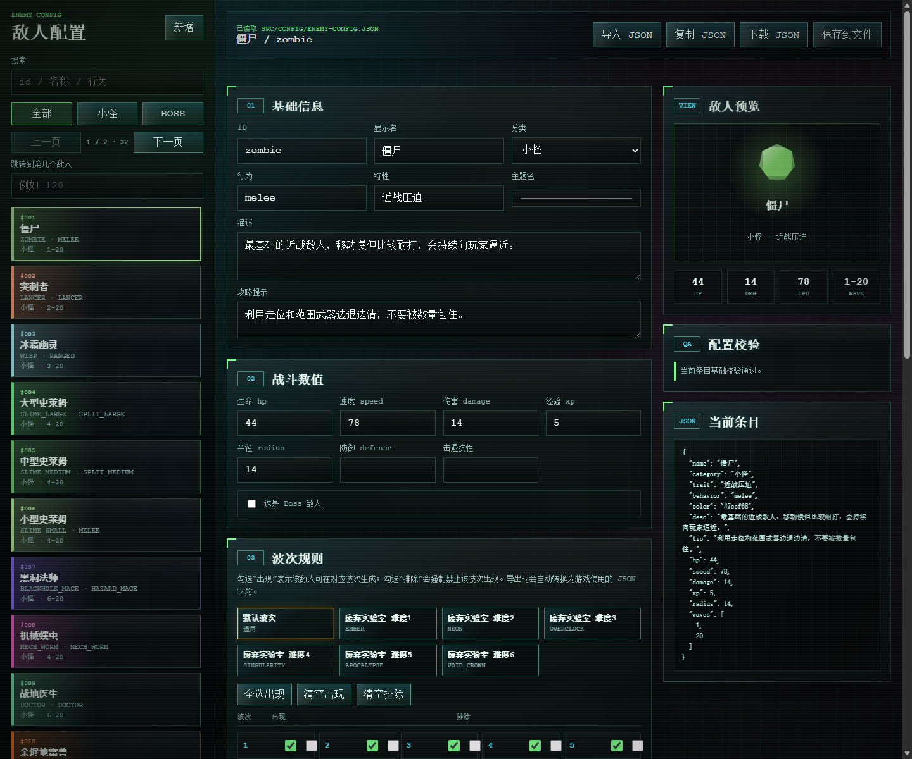

# Survivor 项目说明

## 1. 项目简介

这是一个原生 HTML/CSS/JavaScript（ES Modules）的 2D 像素风生存游戏，无需构建工具。

- 页面入口：`index.html`
- 样式入口：`styles.css`
- 游戏入口：`src/core/game.js`
- 主循环：`src/core/main.js`

## 2. 本地运行

### 2.1 传统方式

在项目根目录执行：

```powershell
python -m http.server 5000 --bind 127.0.0.1
```

浏览器访问：

```text
http://127.0.0.1:5000/
```

### 2.2 一键启动脚本（新增）

项目已新增启动入口：

- `start.cmd`（双击即可）
- `scripts/start.ps1`

脚本能力：

- 自动检测 Python（优先 `python`，其次 `py -3`）
- 默认端口 `5000`
- 若端口被占用，自动向后寻找可用端口
- 默认自动打开浏览器

用法示例：

```powershell
# 方式1：直接双击 start.cmd

# 方式2：PowerShell 启动
.\scripts\start.ps1

# 指定端口
.\scripts\start.ps1 -Port 5500

# 不自动打开浏览器
.\scripts\start.ps1 -NoBrowser
```

### 2.3 敌人配置编辑器

项目提供了与游戏主进程独立的可视化配置页面：

```text
http://127.0.0.1:5000/tools/enemy-config-editor.html
```

也可以直接双击：

```text
enemy-config-editor.cmd
```

如果手动访问 URL，建议先用 `start.cmd` 或 `python -m http.server 5000 --bind 127.0.0.1` 启动本地服务；双击 `enemy-config-editor.cmd` 会自动启动服务并打开该页面。

编辑器能力：

- 自动读取 `src/config/enemy-config.json`
- 可视化编辑敌人基础信息、战斗数值、波次勾选规则、难度限制
- 波次和难度都通过勾选/下拉选择，导出时自动转换成游戏读取的 JSON 字段
- 支持“默认波次”和“每个难度独立波次”，用于同一敌人在不同难度中使用不同出现波次
- 支持默认权重、每个难度权重、每个难度每个波次权重，用于控制不同敌人的出现频率
- 左侧敌人列表支持搜索、筛选、分页和序号跳转
- 支持新增、复制、删除、恢复单个敌人
- 支持导入 JSON、复制 JSON、下载 JSON
- 在支持 File System Access API 的浏览器中，可使用“保存到文件”

浏览器通常不能静默改写本地项目文件。若“保存到文件”不可用，请下载或复制生成的 JSON，再覆盖 `src/config/enemy-config.json`。



---

## 3. 部署方式

项目已内置部署文件：

- Nginx（宿主机）：`deploy/nginx/survivor.conf`
- Docker：`Dockerfile`、`docker-compose.yml`、`nginx/default.conf`

### 3.1 Nginx 部署（Linux）

1. 上传项目到服务器目录（例如 `/var/www/survivor`）。
2. 复制配置文件：

```bash
sudo cp /var/www/survivor/deploy/nginx/survivor.conf /etc/nginx/conf.d/survivor.conf
```

3. 按实际环境修改 `server_name`、`root`。
4. 检查并重载：

```bash
sudo nginx -t
sudo systemctl reload nginx
```

5. 访问：`http://your-domain.com:5000/`

### 3.2 Docker 部署（Linux / Windows）

在项目根目录执行：

```bash
docker compose up -d --build
```

查看状态：

```bash
docker compose ps
docker compose logs -f
```

访问：`http://<服务器IP>:5000/`

### 3.3 Windows 电脑部署

#### 方案 A：Nginx for Windows

1. 下载并解压 Nginx Windows 版本（例如解压到 `C:\nginx`）。
2. 将项目放到例如 `C:\www\survivor`。
3. 打开 `C:\nginx\conf\nginx.conf`，在 `http {}` 内添加或修改：

```nginx
server {
    listen 5000;
    server_name localhost;

    root C:/www/survivor;
    index index.html;

    location / {
        try_files $uri $uri/ /index.html;
    }

    location ~* \.(js|mjs|css|png|jpg|jpeg|gif|ico|svg|webp|mp3|wav|ogg|json)$ {
        expires 7d;
        add_header Cache-Control "public, max-age=604800";
        try_files $uri =404;
    }
}
```

4. 启动 Nginx：

```powershell
cd C:\nginx
.\nginx.exe
```

5. 重载/停止：

```powershell
.\nginx.exe -s reload
.\nginx.exe -s quit
```

6. 本机访问：

```text
http://127.0.0.1:5000/
```

如果需要局域网访问，请在 Windows 防火墙放行 5000 端口。

#### 方案 B：Docker Desktop（Windows）

1. 安装 Docker Desktop 并确保已启动。
2. 在项目根目录执行：

```powershell
docker compose up -d --build
```

3. 访问：`http://127.0.0.1:5000/`

---

## 4. `difficulty-config.json` 配置说明

文件路径：`src/config/difficulty-config.json`

### 4.1 结构规则

- 顶层是对象，键名就是难度 id（例如 `neon`、`overclock`）。
- 难度顺序由 JSON 中的出现顺序决定，影响：
  - 难度卡片展示顺序
  - 通关解锁下一难度顺序
  - `enemy-config.json` 中 `minDifficulty` / `maxDifficulty` 的比较顺序

### 4.2 单个难度字段

每个难度对象建议包含以下字段：

- `name`：难度显示名（UI 展示）
- `desc`：难度描述（UI 展示）
- `enemyLimit`：同屏敌人数上限
- `spawnRate`：刷怪速率倍率（影响刷怪预算增长）
- `enemyHp`：普通敌人生命倍率
- `enemyDamage`：普通敌人伤害倍率
- `enemySpeed`：敌人移速倍率
- `enemyAttackSpeed`：敌人攻击频率倍率（用于敌人攻击冷却）
- `bossHp`：Boss 生命倍率
- `bossDamage`：Boss 伤害倍率
- `coinGain`：金币收益倍率
- `xpGain`：经验收益倍率

### 4.3 字段生效位置（代码映射）

- 敌人生成上限：`src/systems/enemyRegistry.js`
- 刷怪速率：`src/systems/entities.js`
- 敌人/Boss 属性倍率：`src/enemies/BaseEnemy.js`
- 金币与经验掉落倍率：`src/systems/entities.js`
- 难度解锁与通关记录：`src/difficulty.js`

### 4.4 配置示例

```json
{
  "neon": {
    "name": "废弃实验室 · 难度2",
    "desc": "标准体验，按照当前平衡运行。",
    "enemyLimit": 420,
    "spawnRate": 1,
    "enemyHp": 1,
    "enemyDamage": 1,
    "enemySpeed": 1,
    "enemyAttackSpeed": 1,
    "bossHp": 1,
    "bossDamage": 1,
    "coinGain": 1,
    "xpGain": 1
  }
}
```

### 4.5 调参建议

- 优先小步调整：建议每次改动 3%~12%。
- `spawnRate` 和 `enemyLimit` 同时拉高时，压力会非线性上升。
- `bossHp`、`bossDamage` 建议独立于小怪倍率调节，避免 Boss 波次难度跳变过大。

---

## 5. `enemy-config.json` 配置说明

文件路径：`src/config/enemy-config.json`

### 5.1 结构规则

- 顶层是对象，键名就是敌人 id（例如 `zombie`、`storm_tyrant`）。
- 键名必须和以下位置一致：
  - 敌人类文件名（`src/enemies/<id>.js`）
  - 注册表映射（`src/systems/enemyRegistry.js` 的 `classes`）

### 5.2 单个敌人的基础字段

- `name`：显示名
- `category`：分类（例如 `小怪`、`Boss`）
- `trait`：特性文案（用于 Boss 标题等）
- `desc`：描述文案（图鉴展示）
- `tip`：攻略提示文案（配置层记录）
- `hp`：基础生命
- `speed`：基础速度
- `damage`：基础伤害
- `xp`：击杀经验
- `radius`：碰撞半径/体型半径
- `color`：主题色（渲染/特效色）
- `behavior`：行为类型（驱动 AI 逻辑）
- `boss`：是否 Boss（`true`/`false`）
- `spawnWeight`：默认刷怪权重，默认值为 `1`
- `difficultyWeights`：不同难度的基础权重
- `difficultyWaveWeights`：不同难度、不同波次的精细权重

说明：最终战斗数值会叠加波次成长和难度倍率，不是只用基础值。

### 5.3 波次出现规则

系统支持以下字段，写任意一个即可生效，可组合：

- `waves`
- `waveRanges`
- `spawnWaves`
- `excludeWaves`
- `bossWave`
- `bossWaves`
- `bossWaveRanges`
- `difficultyWaves`

支持的规则写法：

- 单个波次：`5`
- 闭区间：`[3, 8]`（表示 3 到 8 波）
- 多段组合：`[[1, 3], [7, 9], 12]`

匹配逻辑：

1. 小怪优先看 `waves` / `waveRanges` / `spawnWaves`
2. Boss 优先看 `bossWave` / `bossWaves` / `bossWaveRanges`，同时兼容 `waves` 等通用字段
3. 只要命中任一“包含规则”就可出现
4. 若命中 `excludeWaves`，则强制不出现

### 5.4 不同难度的独立波次

如果同一个敌人在不同难度中出现波次不同，可以使用 `difficultyWaves`。

`difficultyWaves` 的键名是难度 id，值是该难度自己的波次规则。该字段只覆盖指定难度；没有配置的难度继续使用外层默认波次规则。

示例：

```json
{
  "zombie": {
    "name": "僵尸",
    "category": "小怪",
    "waves": [1, 20],
    "difficultyWaves": {
      "ember": { "waves": [1, 12] },
      "neon": { "waves": [1, 20] },
      "overclock": { "spawnWaves": [1, 2, 3, 8, 9, 10] },
      "apocalypse": { "waves": [1, 20], "excludeWaves": [5, 10, 15] }
    }
  }
}
```

Boss 也支持该字段：

```json
{
  "storm_tyrant": {
    "boss": true,
    "bossWave": 5,
    "difficultyWaves": {
      "ember": { "bossWave": 6 },
      "overclock": { "bossWaves": [5, 9] }
    }
  }
}
```

### 5.5 难度过滤规则

可选字段：

- 包含：`difficulties` / `difficultyIds` / `difficulty`
- 排除：`excludeDifficulties` / `disabledDifficulties`
- 区间：`minDifficulty`、`maxDifficulty`

示例：

- 仅在高难出现：`"minDifficulty": "overclock"`
- 最高只到某难度：`"maxDifficulty": "apocalypse"`
- 指定白名单：`"difficulties": ["neon", "overclock"]`
- 指定黑名单：`"excludeDifficulties": ["ember"]`

### 5.6 出现权重规则

普通小怪会按权重随机刷出。权重越高，出现频率越高；权重为 `0` 表示当前条件下不会被随机刷出。

优先级从高到低：

1. `difficultyWaveWeights[当前难度][当前波次]`
2. `difficultyWeights[当前难度]`
3. `spawnWeight`
4. 默认 `1`

示例：

```json
{
  "zombie": {
    "spawnWeight": 1,
    "difficultyWeights": {
      "ember": 2,
      "neon": 1,
      "overclock": 0.7
    },
    "difficultyWaveWeights": {
      "overclock": {
        "1": 3,
        "2": 2,
        "10": 0
      },
      "apocalypse": {
        "1": 0.5,
        "15": 4
      }
    }
  }
}
```

### 5.7 小怪配置示例

```json
{
  "razorbat": {
    "name": "刃翼蝠",
    "category": "小怪",
    "trait": "回旋刃翼",
    "waves": [11, 20],
    "hp": 99,
    "speed": 150,
    "damage": 13,
    "xp": 8,
    "radius": 12,
    "color": "#c7d2ff",
    "behavior": "razorbat",
    "desc": "会高速绕场飞行，并投掷会折返的翼刃回旋镖。",
    "tip": "留意弧线返回的翼刃，不要只躲第一段飞行轨迹。"
  }
}
```

### 5.8 Boss 配置示例

```json
{
  "storm_tyrant": {
    "name": "风暴暴君",
    "category": "Boss",
    "trait": "多态弹幕",
    "bossWave": 5,
    "hp": 20000,
    "speed": 64,
    "damage": 34,
    "xp": 180,
    "radius": 62,
    "color": "#42e8ff",
    "behavior": "boss_storm",
    "boss": true,
    "desc": "会在散射、环阵和冲锋之间切换，还会召唤帮手压场。",
    "tip": "预留绕场空间，优先关注它当前切换到的攻击模式。"
  }
}
```

### 5.9 新增敌人的最小接入清单

1. 在 `src/enemies/` 新增 `<id>.js` 类文件。
2. 在 `src/systems/enemyRegistry.js` 的 `classes` 注册该 id。
3. 在 `src/config/enemy-config.json` 增加同 id 配置。
4. 至少配置一种波次规则（否则可能不会在普通刷怪中出现）。
5. 若为 Boss，设置 `boss: true` 和 Boss 波次规则。

---

## 6. 游戏截图

待补充

---

## 7. 配置修改后验证

### 7.1 JSON 合法性检查

```powershell
node -e "JSON.parse(require('fs').readFileSync('src/config/enemy-config.json','utf8')); JSON.parse(require('fs').readFileSync('src/config/difficulty-config.json','utf8')); console.log('json ok')"
```

### 7.2 JavaScript 语法检查

```powershell
Get-ChildItem -Path src -Recurse -Filter *.js | ForEach-Object { node --check $_.FullName }
```

### 7.3 Diff 空白错误检查

```powershell
git diff --check
```
